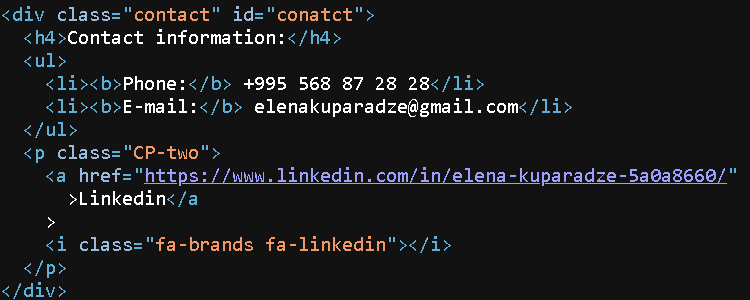

### Scoring criteria
| Criteria                                                                                                                                                                                             | Points                   |
|:-----------------------------------------------------------------------------------------------------------------------------------------------------------------------------------------------------|:-------------------------|
| Deployed on `gh-pages`, the link is submitted                                                                                                                                                        | 10                       |
|GM chck 
Correct
                                                                                                                                                        | 
10
                      |
| The layout pass the validation (https://validator.w3.org/).  "Document checking completed. No errors or warnings to show."  in case no errors, but exist warning                             |  10  5           |
|GM chck 
Correct
                             | 
10
           |
| There are semantic tags in the code (pay attention, they should be logically used, not just for points)  `header`, `main`, `footer`   `nav`    only one `h1` for page   several `h2` |  5 5 5 5 |
|GM chck 
semantic tags  `header`, `main`, `footer`   `nav`    only one `h1` for page   several `h2` 
 | 
5

5

5

5
 |
| Footer contains link to your github , date (month, year), course logo with the link                                                                                                                      | 10                       |
|GM chck 
Footer contains links
                                                                                                                                           |
10
                     |
| Present css styles                                                                                                                                                                                   | 10                       |
|GM chck 
Css styles 
                                                                                                                                             | 
10
                     |
| Horizontal centegreen layout (decreasing the browser width - the layout still in the center)                                                                                                           | 10                       |
| GM chck 
decreasing the browser width - the layout still in the center 
                                                                             | 
10
                       |
| The photo exist, the alt attribute is present                                                                                                                                                        | 10                       |
| GM chck 
photo exist, the alt attribute is present  
                                                                        | 
10
                       |
| Navigation (contacts and skills) did with `ul > li` or `ul > li > a`                                                                                                                                 | 10                       |
| GM chck 
 'contacts' has `ul > li` or `ul > li > a`  
                                                                          | 
10
                       |
| Brief information about yourself                                                                                                                                                                     | 5                        |
| GM chck 
 Done 
                                                                                                         | 
5
                       |
| Contacts                                                                                                                                                                                             | 5                        |
| GM chck 
 contact info present 
                                                                                                         | 
5
                       |
| Skills                                                                                                                                                                                               | 5                        |
| GM chck 
 skills present 
                                                                                                         | 
5
                       |
| Code examples ( using appropriate symbols or tags)                                                                                                                                                   | 5                        |
| GM chck 
code example in image 
                                                                                                         | 
5
                       |
| Project examples ( if you have no, add the link to CV task)                                                                                                                                          | 5                        |
| GM chck 
 Project examples
                                                                                                         | 
5
                       |
| Education and English level                                                                                                                                                                          | 5                        |
| GM chck 
 Education and English leve
                                                                                                         | 
5
                       |

**Total score** available 120 points

<b>Check Score 90</b>

Comments for check:
 - each section instead of `div` you could use `article`, You have nice structure  have title and content
 - related to repository structure. You have assets and images folder. move all images there 😏
 - Code example are in image. You could make it with `code` tag. If I want to copy it I can not.
 - Thanks for good and nice work 👍