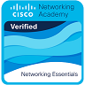
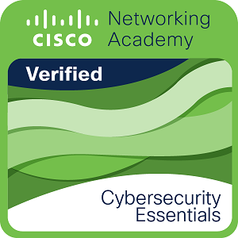

# rsschool-cv
[https://gintsm.github.io/rsschool-cv/cv](https://gintsm.github.io/rsschool-cv/cv)

### Gints Misins
Junior Frontend Developer 
Contact information:
E-mail: gintsmis@gmail.com
[LinkedIn](https://www.linkedin.com/in/gints-misins-756b2321a/)
[Github](https://github.com/GintsM)

Briefly About Myself:

Can say I’m a junior software developer. Have worked in several fields and positions. From a conveyor worker in a plywood factory, self employed as carpenter, then roofer combined with supervisor and estimator. Til a director for a small/almost middle  company (2016-2019) we worked on soil drainage. 
I love movement of any kind. I'm active physically and the same way I like to move my brains, can even replace activities with working on brain tasks. When demand on drainage dramatically fell I started to search for new fields where I can be useful, and chose programming. Still newbie in mind, but I can see some progress and will work hard to achieve good results.

Skills and Proficiency:
HTML5, CSS3
JavaScript,
React,
Git, GitHub

Met Python, JAVA and C++ on a way.

Code example:
Probably this whould be great [My Sudoku app](https://github.com/GintsM/JS_Canvas_Playground/blob/main/src/canvas.js). It is not complete yet. Continue to work on it

Courses, Education :
Several Years as building engineer in LLU(Latvian Agricultura University)
Online Cisco network courses

[verify in Credly](https://www.credly.com/badges/af3bffb7-3374-4751-b02b-69264360918f/public_url)

[verify in Credly](https:https://www.credly.com/badges/83868cda-3241-4c17-8e83-a410ba0ed86c/public_url)

Languages:
Latvian - Native
English - Good
Norwegian - Good
Russian - speach - Good, writing(not so)
